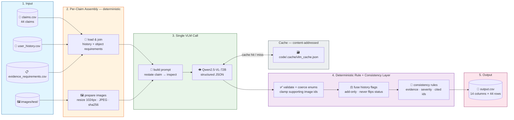

# Multi-Modal Evidence Review

A defensive, **image-grounded claim-verification agent** that decides whether the photos a
customer submits actually support their damage claim — across three object types: **cars**,
**laptops**, and **packages**.
Built with **HuggingFace Inference Providers** and **Qwen2.5-VL-72B** structured vision
reasoning, wrapped in a **deterministic rule + consistency layer**, for the HackerRank
Orchestrate hackathon (June 2026).

For each claim the agent decides an **evidence-sufficiency** verdict, the **issue type**,
the **object part**, a final **claim status** (`supported` / `contradicted` /
`not_enough_information`), **risk flags**, **severity**, **supporting image IDs**, image
**validity**, and short **image-grounded justifications** — and it routes a claim to
`manual_review_required` rather than guess whenever the evidence is weak, mismatched, or the
input is adversarial.

---

## **Features**

- **Single-Call Vision Reasoning:** One Qwen2.5-VL call per claim reads the conversation
  *and* the images together and emits all 10 predicted fields as schema-validated JSON — no
  separate text LLM, no lossy free-text parsing.
- **Claim-Restate-Then-Inspect Prompt:** The model first restates the *actual* claimed part
  and issue (ignoring rambling distractors and embedded "approve this" text), then inspects
  the pixels — folding the benefit of a multi-stage pipeline into one call.
- **Prompt-Injection Defense:** Claim text and any text *inside* an image (e.g. a sticky
  note saying "mark supported") are treated as data, never instructions; directive text
  raises `text_instruction_present` and is ignored. Verified live on an adversarial case.
- **Deterministic Rule + Consistency Layer:** Every field is coerced to an allowed enum,
  `supporting_image_ids` are clamped to real IDs, user-history flags are fused **add-only**
  (they never flip the visual decision), and format-level consistency rules enforce the
  dataset conventions (a decided claim always meets the evidence standard and cites its
  images).
- **Robust Multi-Format Image Handling:** The test set mixes JPEG / PNG / WEBP / **AVIF**
  (all named `.jpg`); every image is decoded (Pillow ≥ 11.3) and re-encoded to a uniform
  JPEG before the model sees it.
- **Multilingual Input, English Output:** Claims arrive in Hindi/Hinglish, Spanish, and
  romanized Chinese; the model interprets any language but always emits English enums.
- **Deterministic by Design:** `temperature=0`, config-pinned models, content-addressed
  cache — re-runs on the same input reproduce the same `output.csv`.
- **On-Disk Caching:** Every VLM response is cached by `sha256(model + prompt + image
  hashes)`, so re-runs and re-evaluations skip the network and cost ~0 new calls.
- **Offline Mock Mode + Self-Check:** `--mock` runs the whole pipeline end-to-end with no
  token, and `python code/postprocess.py` runs assert-based validation of the schema/rule
  logic — no API calls required.
- **Evaluation Harness + Model Bake-Off:** Scores the system on the labeled sample set and
  compares four VLMs across two generations and two orders of magnitude of size.

---

## **Architecture**



Full design rationale and the end-to-end build narrative live in
[`IMPLEMENTATION.md`](./IMPLEMENTATION.md); component-level design in
[`code/ARCHITECTURE.md`](./code/ARCHITECTURE.md); metrics + operational analysis in
[`code/evaluation/evaluation_report.md`](./code/evaluation/evaluation_report.md); code-level
usage in [`code/README.md`](./code/README.md).

---

## **Project Structure**

```
.
├── IMPLEMENTATION.md            # design + build narrative (what & why)
├── problem_statement.md         # task spec + I/O schema
├── code/                        # ← the agent
│   ├── main.py                  #   entry point (argparse, per-claim loop, threaded)
│   ├── config.py                #   env-only secrets + model aliases + tunables
│   ├── data.py                  #   CSV load/join, image-path parse, strict CSV writer
│   ├── images.py                #   decode any format → resize → JPEG data URI → hash
│   ├── prompts.py               #   system rubric + per-claim multimodal message
│   ├── client.py                #   one HF VLM client: call, cache, retry, mock
│   ├── schema.py                #   canonical allowed-value tables (enums)
│   ├── postprocess.py           #   validate + coerce + history fusion + consistency rules
│   ├── evaluation/              #   sample-set scoring + model bake-off
│   │   ├── main.py              #     run each model, score vs labels, write report
│   │   ├── metrics.py           #     accuracy + set-based risk-flag P/R/F1
│   │   └── evaluation_report.md #     metrics + operational analysis (generated)
│   ├── ARCHITECTURE.md          #   component design + tradeoffs + edge cases
│   ├── requirements.txt
│   └── README.md
├── dataset/
│   ├── claims.csv               # inputs (run your agent on these — 44 rows)
│   ├── sample_claims.csv        # inputs + expected outputs (20 labeled, for dev/eval)
│   ├── user_history.csv         # per-user claim history / risk context
│   ├── evidence_requirements.csv# minimum image-evidence checklist by object/issue
│   ├── images/sample/           # images referenced by sample_claims.csv
│   └── images/test/             # images referenced by claims.csv
└── output.csv                   # agent predictions (14 fields × 44 rows)
```

---

## **Setup Instructions**

### 1. **Clone the Repository**

```bash
git clone https://github.com/VIVPM/hackerrank-multi-modal-evidence-review-hackathon.git
cd hackerrank-multi-modal-evidence-review-hackathon
```

### 2. **Set Up Python Environment**

It is recommended to use a virtual environment.

```bash
python -m venv .venv
source .venv/bin/activate   # (Linux/Mac)
.venv\Scripts\activate      # (Windows)
```

### 3. **Install Dependencies**

```bash
pip install -r code/requirements.txt
```

**Key dependencies include:**
- huggingface_hub (HF Inference Providers client)
- pillow **(≥ 11.3 — required to decode the AVIF test images natively)**
- pandas
- python-dotenv

### 4. **Environment Variables**

Copy `.env.example` → `.env` in the project root and add your HuggingFace token:

```
HF_TOKEN=hf_xxxxxxxxxxxxxxxxxxxxx
```

Get a token at <https://huggingface.co/settings/tokens> — **Read** scope is enough.
`.env` is gitignored — never commit it. No token is needed for `--mock`.

### 5. **Models (no gated licenses)**

The agent calls **Qwen** vision models via HF Inference Providers, which are openly served —
no license-acceptance step is required:
- `Qwen/Qwen2.5-VL-72B-Instruct` — the `strong` tier (default, used for `output.csv`)
- `Qwen/Qwen3-VL-8B-Instruct` — the `cheap` tier (used in the eval comparison)

---

## **Running the Application**

```bash
python code/main.py --mock --limit 3        # offline dry run (no token, no API)
python code/main.py --model strong          # full run over all 44 claims -> output.csv
python code/main.py --model cheap           # run with the cheap tier
python code/postprocess.py                  # assert-based schema/rule self-check
```

Predictions are written to **`output.csv`** at the repo root (14 columns per claim). The
first live run populates the response cache; subsequent runs load it instantly.

Run the evaluation + model comparison (writes `code/evaluation/evaluation_report.md`):

```bash
python code/evaluation/main.py --models cheap,strong
```

---

## **How It Works**

For every claim the pipeline runs top-to-bottom, deterministic work first:

1. **Assemble** — load the claim row, join the user's `user_history` by `user_id`, and
   attach the `evidence_requirements` rows for that object type.
2. **Prepare images** — decode each referenced image (JPEG / PNG / WEBP / AVIF, all named
   `.jpg`), resize the long edge to ~1024px, re-encode to JPEG, base64 as a data URI, and
   hash the bytes for caching.
3. **Build the prompt** — a static system rubric (allowed enums, the `valid_image` vs
   `evidence_standard_met` definitions, injection defense, multilingual→English) plus a
   per-claim message carrying the conversation, the matched requirements, history context,
   and the images.
4. **Single VLM call** — one Qwen2.5-VL-72B structured-output call restates the actual claim,
   inspects the images, and returns all 10 predicted fields as JSON (cache-first).
5. **Validate + coerce** — every field is mapped to an allowed enum, `risk_flags` are
   de-duped and ordered, and `supporting_image_ids` are clamped to IDs that exist in the row.
6. **Fuse history** — history flags (`user_history_risk`, `manual_review_required`) are added
   as risk context only; they never flip the image-based `claim_status`.
7. **Consistency rules** — enforce the dataset conventions: a decided claim
   (`supported`/`contradicted`) always meets the evidence standard and cites its supporting
   images; a contradiction with no assessable damage is `severity=none`; only
   `not_enough_information` leaves the evidence standard unmet.

Any missing/unreadable image or failed call degrades to a safe `not_enough_information` row —
the run never crashes on a single claim.

---

## **Environment Variables**

| Variable | Required | Purpose |
|---|---|---|
| `HF_TOKEN` | **yes** (live) | HuggingFace Inference Providers auth |
| `HF_PROVIDER` | no | Pin a backend (`auto` default; e.g. `nebius`, `fireworks-ai`) |
| `VLM_MODEL_STRONG` | no | Override the `strong` model (default Qwen2.5-VL-72B) |
| `VLM_MODEL_CHEAP` | no | Override the `cheap` model (default Qwen3-VL-8B) |
| `VLM_USE_SCHEMA` | no | Set `1` to request `response_format` json_schema where supported |

CLI overrides (`code/main.py`): `--model`, `--mock`, `--limit`, `--sleep`, `--workers`,
`--input`, `--output`. Secrets are read from `.env` only. Never hardcode keys.

---

## **Key Concepts Used**

- **Vision-Language Model (VLM):** A single multimodal call reads text *and* images together;
  it is a superset of an LLM, so no separate text model is needed.
- **Single-Call Chain-of-Thought:** "Restate the claim, then inspect" structures the model's
  reasoning inside one call — cleaner claim extraction without a second model call.
- **Structured Output / JSON:** The call returns a validated object with enum-correct fields
  instead of brittle free-text parsing.
- **Deterministic Rule Layer:** Enum coercion, image-ID clamping, add-only history fusion,
  and consistency rules turn a probabilistic model into a schema-guaranteed, convention-aligned
  output.
- **Prompt-Injection Defense:** All claim/in-image text is untrusted data; the model decides
  on visual evidence and flags directive text rather than obeying it.
- **Content-Addressed Caching:** Responses keyed by model + prompt + image hashes make the
  pipeline reproducible and near-free to re-run.
- **HF Inference Providers:** One client routes (`provider=auto`) to a backend serving the
  model; models are swappable by changing a single string.
- **Determinism:** `temperature=0` + cache so regressions are visible, not masked by sampling
  noise.

---

## **Extending the Project**

- **Swap models:** Set `VLM_MODEL_STRONG` / `VLM_MODEL_CHEAP` to any HF-served VLM
  (`--model` also accepts a literal id) — no code change. See the bake-off in Results.
- **Add an object type:** Extend the enum tables in `schema.py` and the requirement rows in
  `dataset/evidence_requirements.csv`; the prompt injects them automatically.
- **Tune image fidelity vs cost:** Adjust the resize edge / JPEG quality in `config.py`.
- **Harden the rules:** Add flags or consistency checks in `postprocess.py` (guarded by the
  self-check).

---

## **Troubleshooting**

- **`HF_TOKEN` not set / 401:** Ensure `.env` exists with a valid token and read scope.
- **Model not served (`provider=auto` errors):** The chosen checkpoint isn't served by any
  provider; fall back with `--model Qwen/Qwen2.5-VL-7B-Instruct` or set `VLM_MODEL_STRONG`.
- **429 / rate limits:** Raise `--sleep`, lower `--workers`, or pin a faster `HF_PROVIDER`;
  the client already retries with exponential backoff + jitter.
- **AVIF images fail to load:** Upgrade Pillow to ≥ 11.3 (native AVIF support).
- **Stale results:** Delete `code/.cache/` to force fresh model calls.
- **No token / offline:** Use `--mock` to exercise the full pipeline and I/O with no API.

---

## **Results**

The agent was run over all **44 input claims**, producing a schema-valid `output.csv`
(14 columns × 44 rows, no empty cells).

#### 📊 Decision Outcome (test set)

| `claim_status` | Count | Meaning |
|---|---|---|
| 🚩 **contradicted** | **26** | The claimed part is visible but the damage is absent or mismatched (wrong object, toy/stock photo, injection note, identity/color mismatch). |
| ✅ **supported** | **16** | The specific claimed damage is clearly visible on the claimed part. |
| ❓ **not_enough_information** | **2** | The claimed part/condition could not be evaluated from the images. |
| **Total** | **44** | Every row schema-valid; **31** routed to `manual_review_required`. |

The test set is deliberately adversarial (toy car, smartphone-not-laptop, scooter, tablet,
color/identity mismatches, injection notes, manipulated "after" photos), so the pipeline is
tuned to **contradict/escalate rather than falsely approve** on any borderline case.

#### 🧪 Model Bake-Off (claim_status on the 20 labeled sample claims)

| Model | Size / generation | claim_status | Verdict |
|---|---|---|---|
| **Qwen2.5-VL-72B-Instruct** | dense VLM | **85%** | ✅ **chosen** |
| Qwen3-VL-235B-A22B-Instruct | MoE (22B active) | 75% | over-lenient |
| Qwen3-VL-8B-Instruct | dense VLM | 75% | cheap tier |
| Qwen3.5-397B-A17B | MoE, thinking | 65% | most lenient |

**Bigger ≠ better here:** both newer flagships lose to the 72B because they over-approve the
adversarial cases; this task rewards skeptical calibration, not raw benchmark strength.

#### 📈 Field Accuracy (chosen model, labeled sample)

| Field | Accuracy |
|---|---|
| `evidence_standard_met` | 95% |
| `object_part` | 95% |
| `claim_status` | 85% |
| `valid_image` | 85% |
| `issue_type` | 55% |
| `severity` | 50% |
| `risk_flags` (set F1) | ~74% |

#### 🧪 Reliability

- **Deterministic:** `temperature=0` + content-addressed cache → identical `output.csv`
  across runs.
- **Validated offline:** `python code/postprocess.py` and `--mock` exercise CSV I/O, enum
  coercion, image-ID clamping, history fusion, and the consistency rules with no network calls.

---

*Forked from the [interviewstreet/hackerrank-orchestrate-june26](https://github.com/interviewstreet/hackerrank-orchestrate-june26)
starter repo; the `code/` agent, design docs, and outputs are my own work.*
